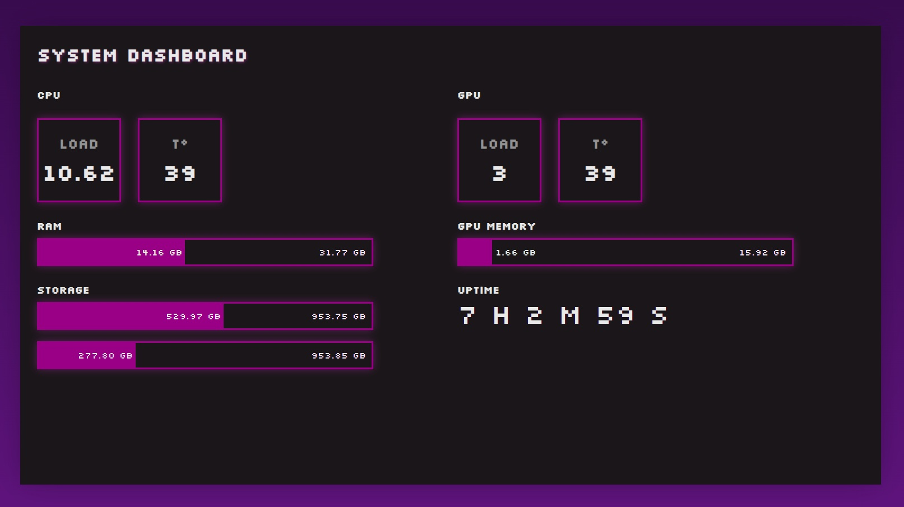

# System dashboard



Frontend app for a minimalistic dashboard with main metrics of machine.

## Features

- Built with Vue 3, TypeScript
- Backend: https://github.com/yurirodnov/system-data-collector
- Retro pixel design

## Local run

Needs running backend on the same host

1.  **Clone the repo:**

    ```bash
    git clone https://github.com/yurirodnov/system-dashboard.git
    ```

    or via SSH

    ```bash
    git clone git@github.com:yurirodnov/system-dashboard.git
    ```

2.  **Go to an app directory:**
    ```bash
    cd system-dashboard
    ```
3.  **Install dependencies:**
    ```bash
    npm install
    ```
4.  **Run the dev server:**
    ```bash
    npm run dev
    ```
5.  **Open the link shown in the terminal (usually `http://localhost:5173`)**.

6.  **Build for production (optional)**:
    ```bash
    npm run build
    npm run preview
    ```
